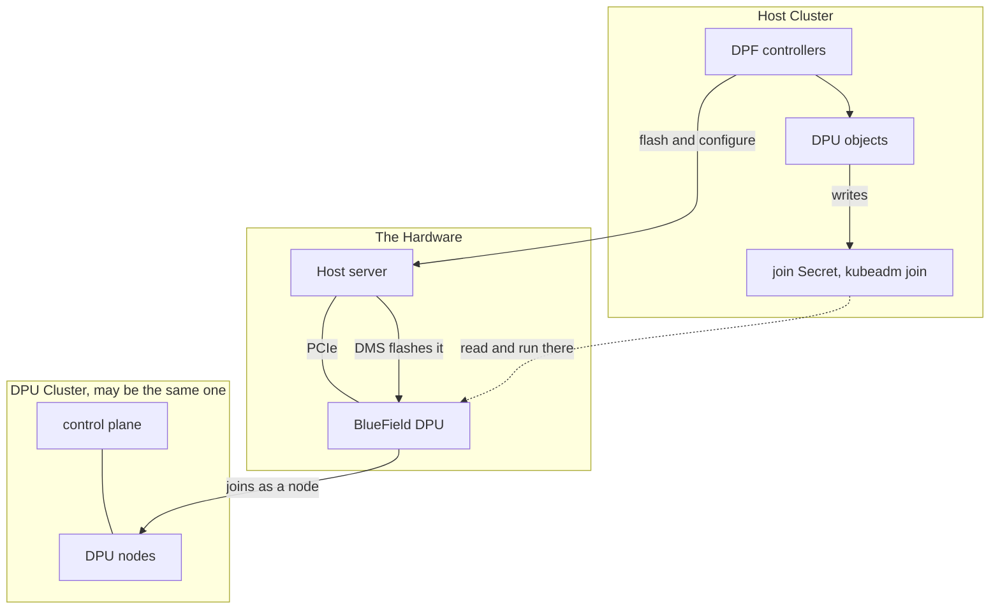
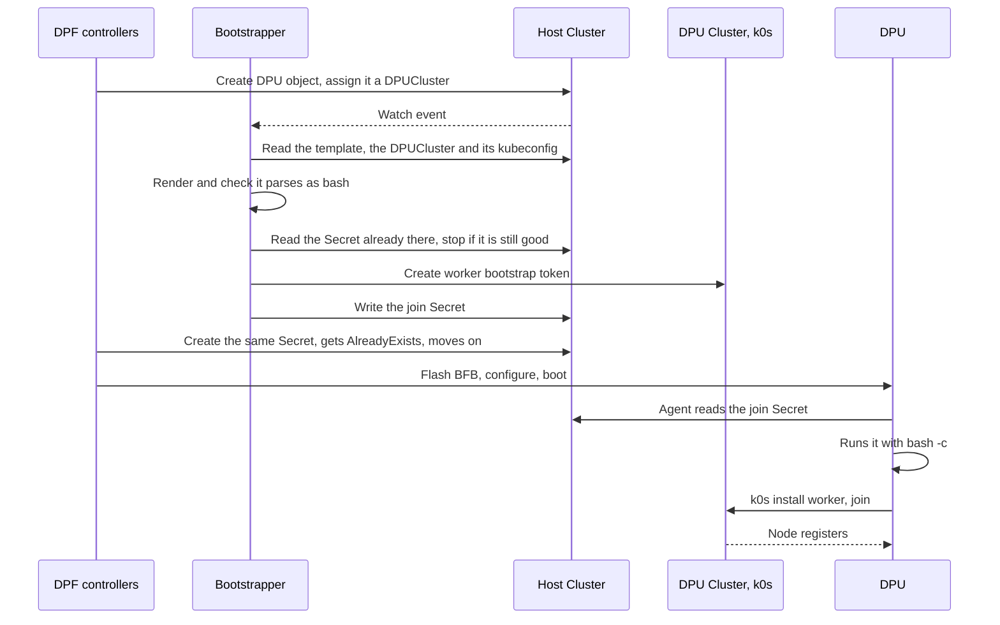

## What a DPU Actually Is

A **DPU**, or Data Processing Unit, is a PCIe network card with a whole ARM SoC on it. Its own
CPU, its own memory, its own storage, its own operating system, its own BMC and its own out of
band management port. An NVIDIA BlueField-3 carries up to 16 ARM cores and up to 32 GB of
DDR5, depending on the SKU, booting a full Ubuntu install off on-board flash. It is not a
smart NIC in the sense of a NIC with a bit of offload logic. It is a small ARM server that
plugs into another server's PCIe slot and happens to also be that server's network adapter.

A BlueField runs in one of three modes. In **NIC mode** the ARM OS never boots and the card is
an ordinary high throughput network adapter. In **DPU mode** those cores boot an operating
system of their own and run Open vSwitch with hardware offload, so a flow is decided in
software once on the card and every packet after that is switched by the ASIC. The third,
zero-trust, is DPU mode with the host side locked out.

Being both at once is what makes DPUs unique. The card is a machine of its own and a part of
the machine it plugs into. It boots independently, and its operating system can reboot itself
without touching the host. Power is the one thing it does not bring with it. It draws from the
same PSU as the server, over the slot and an auxiliary cable, so cutting power to the card
means cutting power to the server, and a firmware level change takes the host down with it,
either a reboot or a full cold boot. From the host's point of view it is a NIC. From its own
point of view it is a server.

The reason anyone cares is offload. Networking, storage, and security work that would
otherwise burn host CPU runs on the card instead. The ARM cores run the OVS control plane,
and the flows they install land in the embedded switch of a ConnectX-7 built into the same
chip, which is what forwards the traffic.

So the goal is straightforward. Make the card a worker node, and control it declaratively with
the same Kubernetes primitives as everything else in the cluster.

NVIDIA ships a framework for managing these cards at fleet scale. It provisions them, flashes
them, configures their networking, and finally enrolls them as Kubernetes nodes. That last step
assumes **kubeadm**. If your cluster is k0s, or anything else that bootstraps differently,
everything works except the last step. The card ends up flashed, configured, booted, and still
not a node.

## What DPF Does

**DPF**, the DOCA Platform Framework, is NVIDIA's Kubernetes-native system for managing
BlueField DPUs. It is a set of controllers and CRDs that discover the cards, flash firmware
onto them, configure their networking, and enroll them into a cluster. That firmware arrives
as a **BFB**, a BlueField Bootstream, which bundles the firmware and the DPU operating system
into a single file. Think of it as the card's install image.

DPF describes the world in terms of two roles, a host cluster and a DPU cluster.



The **host cluster** is where you work. It runs the DPF operator and holds the objects that
describe what you want. You create a `BFB` pointing at a firmware bundle, a `DPUFlavor`
describing how the card should be configured, and a `DPUSet` selecting which hosts to act on.
DPF produces one `DPU` object per matched card and drives each through a state machine that is
thirteen phases deep, running from initializing, through firmware parameters, prepare BFB and OS
installing, to cluster config and ready.

The **DPU cluster** is whichever cluster the DPUs join as nodes. By default DPF stands up a
separate one, a Kamaji tenant control plane running as pods in the host cluster. It does not
have to be separate. Point a `DPUCluster` of `type: static` at the cluster you are already
running and the card comes up as a worker alongside its own host, both in the same
`kubectl get nodes`. That is what happens here, and for a first bring-up it is the easiest
thing to do.

Keeping the two roles straight still matters, because a bootstrap token minted in the wrong
cluster is useless to a DPU, and that mistake is invisible until the join fails.

> Provisioning a DPU reboots its host. That is not a bug, it is how firmware activation works,
> and it means you cannot treat DPUs the way you treat control plane nodes in a multi-node
> cluster.

## What k0s Needs Instead

Partway through the state machine, before the card is flashed, DPF writes a Secret containing a
`kubeadm join` command. The agent on the card runs it once the new OS is up.

DPF ships two cluster managers. Kamaji builds the DPU cluster for you, static takes one you
already run. Either way DPF emits the same join command, and it works whenever the cluster on
the other end is a kubeadm cluster. The join generator asks for the group
`system:bootstrappers:kubeadm:default-node-token`, which the code notes kamaji creates by
default.

So the difference is k0s. The BFB ships kubeadm, kubelet, and the `/etc/kubernetes` layout a
kubeadm join expects. It does not ship k0s. Running the kubeadm join against a k0s API server
would not produce a working node, because k0s lays a cluster out differently. The script in
that Secret therefore has to download k0s, install a worker, and still leave behind the files
the DPF agent reads afterwards.

Both kubeadm and k0s use Kubernetes bootstrap tokens underneath, and that kubeadm group is
harmless, since extra groups are additive and the API server always adds `system:bootstrappers`
on top. So the bare credential would authenticate and get its certificate signed. What differs
is the shape. A kubeadm join takes a
token as `id.secret` on the command line and discovers the cluster from a CA hash. `k0s install
worker` takes `--token-file`, and what it expects in that file is a whole bootstrap kubeconfig,
gzipped and base64 encoded, carrying the API server address, the CA and the token under the user
`kubelet-bootstrap`. The same secret, wrapped differently.

## What DPF Actually Requires

Forking or patching DPF would make every future DPF release your problem. So what does DPF
actually check? The contract between DPF and the card at that final step has three parts.

- a Secret named `<dpu-name>-kubeadm-join`, in the DPU's namespace
- with a key called `join`
- whose value is executed on the card with `bash -c`

That is the whole thing on the write side. The name says kubeadm, but nothing checks that the
contents are a kubeadm command. The agent reads the key and runs it, without parsing or
validating it. Any shell script will do.

> All of this is pinned to DOCA 26.4.

Those three facts only cover writing the Secret. The controller also has to read the DPU
objects, know which condition means the card has joined, and produce a script the agent will
accept. None of that is declared anywhere either, though it all fits in one small file.

So the fix is not to change DPF, it is to write that Secret before DPF does. That only helps
because a `DPUCluster` of `type: static` makes the cluster the card joins your own k0s cluster,
which is what makes a k0s token the right thing to mint at all. DPF looks like it requires
kubeadm, but all it requires is a Secret with a shell script in it.

## Satisfying the Contract

The controller that fills that gap watches `DPU` objects in the host cluster. When one is
assigned to a cluster it manages, it does four things.



1. Find the join script template for that DPU's cluster, a labelled ConfigMap.
2. Render the script and **check that it parses as bash**, so a broken template fails in the
   controller with a line and column instead of on the card, where the only symptom is an
   agent retrying forever.
3. Mint a k0s worker bootstrap token in the DPU cluster, in the shape k0s expects.
4. Write the script to `<dpu>-kubeadm-join`.

DPF then flashes the card, configures it, and runs the Secret, except that the script is now
`k0s install worker` rather than `kubeadm join`. DPF's provisioning role has no `update` or
`patch` on Secrets, so its one write is a `Create` that returns `AlreadyExists` and is ignored.
If DPF does get there first, the controller takes its Secret over, since anything without the
controller's annotation counts as out of date, and the same check catches a Secret edited by
hand, because the annotation holds a hash recomputed from the data every time. Arriving second
costs minutes rather than a reflash, since the agent on the card retries every 30 seconds.

DPF still mints a kubeadm token of its own along the way, and that phase fails if it cannot
reach the DPU cluster to do it, so the `DPUCluster` kubeconfig has to work before anything is
flashed. The token itself expires unused. The controller's tokens are short-lived too, re-minted
before expiry and revoked when replaced, because a DPU can sit parked longer than a token lives.

## Four Rules for the Join Script

The script runs against specific and undocumented expectations. Four matter enough that missing
one stalls provisioning.

**The whole script re-runs every 30 seconds until it succeeds.** Not the failed step, the whole
thing, so every step has to be idempotent and "already done" has to exit 0.

**Neutralise the systemd kubelet unit, never the binary.** The BFB ships a kubelet unit that
fights k0s for the same job, but masking it fails, because a later agent step runs `systemctl
start kubelet` on every boot and starting a masked unit fails permanently. Point its `ExecStart`
at `/bin/sleep infinity`, and name the drop-in so it sorts after DPF's own `10-bf.conf`, which
the agent rewrites on every pass. Leave the binary itself alone, since the agent also runs
`kubelet --version` and requires the `Kubernetes ` prefix.

**Leave `/var/lib/kubelet/config.yaml` parseable.** After the join the agent unmarshals that
file and writes it back with hardening applied. k0s writes no such file, so leave a minimal
valid one or the agent errors out after a join that worked.

**Do not exit 0 until the node exists.** Once the agent records `KubeletConfigured` it stops
re-running the script and the controller stops refreshing the token, both permanently. An early
clean exit therefore ends provisioning with no node and nothing left to retry, and the only way
back is to delete the DPU. Poll for `/var/lib/k0s/kubelet.conf` and fail if it never appears.

## What You Need Before Any of This Works

Roughly ordered by how expensive each one is to get wrong. Hardware and host networking come
first, because nothing downstream works until they are right.

**The DPU's high-speed port physically cabled.** The card's communication channel runs through
that port's embedded switch, so without a link there is no path, even though the host's own
`ethtool` cheerfully reports the link as up. Check from the card, not the host.

**A `br-dpu` bridge on every DPU host.** Without it the DPU never leaves `Initializing`, with
`Initialized=False` and the reason `DPUOOBBridgeNotConfigured`, and nothing else to go on.

**An address for the DPU, and working DNS on it.** DPF expects DHCP on the bridge's segment, and
no address means no image pulls. DNS is the one that misleads. Without it `ntpsec` cannot resolve
its pool, so the clock stays wrong and every TLS handshake fails as "not yet valid", which reads
as a certificate problem rather than a date one.

**A k0s control plane with dynamic config.** Install with `--enable-dynamic-config`, or
`spec.workerProfiles` cannot be applied at runtime. The profile name in your k0s config has to
match the one the join script asks for, or the kubelet never starts.

**A `DPUFlavor` derived from DPF's reference, not written from scratch.** Leave out the
`nvconfig` block and a firmware update resets the card to NIC mode, taking the ARM cores out of
the datapath, so no agent runs and provisioning stalls until another flash cycle. `dpuMode: dpu`
alone will not save you. The spec is immutable, so a change means delete and recreate.

**A `DPUCluster` of `type: static`.** Enable `staticClusterManager` and disable
`kamajiClusterManager`. Only one implementation may run, and static is the one that points DPF
at a cluster you control rather than building its own.

**A kubeconfig that works from inside a Pod.** In a Secret under the key `super-admin.conf`,
built with `--flatten` so the CA is embedded rather than a file path, and pointing at the API
server's real address rather than a `127.0.0.1` tunnel that inside a Pod resolves to the Pod.

**Exactly one primary CNI.** DPF ships multus, flannel, ovs-cni and nvipam as its own services.
If k0s already provides a primary, disable all four in `DPFOperatorConfig`.

**Everything DPF delivers through argo-cd, turned off.** Those components ship as `DPUService`s,
so they pull in argo-cd. Disable `dpuServiceController` and it stops being needed, but then
`serviceSetController`, `sfcController`, `cniInstaller`, `sriovDevicePlugin` and `monitoring`
have to go too, since they arrive the same way and default on. Keep `provisioningController`.
The example config disables ten, not four.

Three charts, in this order.

```bash
helm repo add jetstack https://charts.jetstack.io --force-update
helm repo add nfd https://kubernetes-sigs.github.io/node-feature-discovery/charts --force-update
helm repo add dpf-repository https://helm.ngc.nvidia.com/nvidia/doca --force-update

# cert-manager, because DPF's provisioning manifests create Certificates
helm upgrade --install cert-manager jetstack/cert-manager \
  -n cert-manager --create-namespace --version v1.19.3 \
  --set crds.enabled=true --set startupapicheck.enabled=false

# node-feature-discovery, which publishes the label DPF uses to find hardware.
# The affinity keeps it off DPU nodes, and is required. See the note below.
helm upgrade --install nfd nfd/node-feature-discovery \
  -n node-feature-discovery --create-namespace --version 0.18.3 \
  --set-json 'worker.affinity={"nodeAffinity":{"requiredDuringSchedulingIgnoredDuringExecution":{"nodeSelectorTerms":[{"matchExpressions":[{"key":"node-role.kubernetes.io/dpu","operator":"DoesNotExist"}]}]}}}'

# the DPF operator itself
helm upgrade --install -n dpf-operator-system dpf-operator dpf-repository/dpf-operator \
  --version v26.4.0 --set kamajiEtcdDefrag.enabled=false
```

`kamajiEtcdDefrag.enabled=false` goes with the static route. The chart installs a CronJob that
cannot mount its certificates without kamaji-etcd, and this flag is the only thing that turns it
off, since no `DPFOperatorConfig` field does.

> The affinity is not optional. A DPU's own ConnectX reports the same PCI ID as a BlueField, so
> anything doing PCI detection on a DPU node decides that card is itself a DPU host. NFD labels
> it DPU-capable and DPF schedules a management Pod there that crash loops. DPF's own
> `dpu-detector` lands there too, since its affinity skips only control-plane and master nodes,
> and the card's own PCI numbering then reaches `DPUDevice` status, which the next provisioning
> cycle fails on. Patching its DaemonSet is reverted within seconds, so the lever is
> `node-role.kubernetes.io/master` in the `DPUSet`'s `cluster.nodeLabels`, or turning the
> detector off.

## The Template

The join script is a Go template in a ConfigMap, labelled so the controller finds it and
annotated to scope it to a cluster. Values are separate keys, substituted into a skeleton, so
the shape of the script stays readable while the parts that change per site stay editable.

A ConfigMap rather than a CRD, deliberately. This exists because of an assumption DPF has not
needed to relax yet, so solving that by adding an API of its own would be poor manners, and
installing it adds nothing to the cluster's API surface. The cost is no status subresource, so
failures surface as Warning Events instead, on the `DPU` and on the template ConfigMap when the
template is what is wrong.

<details>
<summary>Join script template, the one the demo cluster ran</summary>

```yaml
apiVersion: v1
kind: ConfigMap
metadata:
  name: k0s-join-script
  namespace: dpf-operator-system
  labels:
    # Only ConfigMaps carrying this label are considered.
    k0s.mirantis.com/dpu-join-script: "true"
  annotations:
    # Exactly one template may serve a given DPU. Annotations rather than labels, because
    # label values are too short for some cluster names.
    k0s.mirantis.com/dpu-cluster-name: dpu-cluster-1
    k0s.mirantis.com/dpu-cluster-namespace: dpf-operator-system
    # Uncomment to store the rendered script without parsing it as bash first.
    # k0s.mirantis.com/skip-script-validation: "true"
data:
  # Exported by the skeleton.

  # k0s v1.36.3 for arm64, matching the control plane. A mirror works too.
  k0sURL: https://github.com/k0sproject/k0s/releases/download/v1.36.3%2Bk0s.2/k0s-v1.36.3%2Bk0s.2-arm64
  criSocket: remote:unix:///run/containerd/containerd.sock
  # The profile the control plane publishes.
  k0sProfile: numa
  # Keeps kubelet state in one place on the node.
  kubeletRootDir: /var/lib/kubelet
  extraArgs: --labels dpu=true
  # Steps are replaced one at a time. Values are substituted verbatim, so a step reads
  # the skeleton's shell variables and starts at column zero.

  # Neutralised, not masked, so the agent step that starts the kubelet still works.
  stepNeutraliseKubelet: |-
    install -d -m 0755 "$(dirname "$NEUTRALIZE_DROPIN")"
    cat > "$NEUTRALIZE_DROPIN" <<'DROPIN'
    [Service]
    ExecStart=
    ExecStart=/bin/sleep infinity
    Restart=always
    DROPIN
    systemctl daemon-reload
    systemctl stop kubelet 2>/dev/null || true
  # The agent parses this file afterwards and fails without it. k0s writes no such file.
  stepKubeletConfig: |-
    install -d -m 0755 "$(dirname "$KUBELET_CONFIG")"
    cat > "$KUBELET_CONFIG" <<'KUBELETCFG'
    apiVersion: kubelet.config.k8s.io/v1beta1
    kind: KubeletConfiguration
    KUBELETCFG
  # A BFB never ships k0s. Leave the stock kubelet binary, the agent reads its version.
  stepInstallK0s: |-
    if [ ! -x "$K0S_BIN" ]; then
      tmp="$(mktemp)"
      curl -fsSL --retry 5 --retry-delay 5 -o "$tmp" "$K0S_URL"
      install -m 0755 "$tmp" "$K0S_BIN"
      rm -f "$tmp"
    fi
  # The token minted for this DPU.
  stepWriteToken: |-
    install -d -m 0700 "$(dirname "$TOKEN_FILE")"
    ( umask 077; printf '%s' "$JOIN_TOKEN" > "$TOKEN_FILE" )
  # Raised limits and out of memory protection. The unit need not exist yet.
  stepWorkerService: |-
    install -d -m 0755 /etc/systemd/system/k0sworker.service.d
    cat > /etc/systemd/system/k0sworker.service.d/override.conf <<'OVERRIDE'
    [Service]
    LimitNOFILE=1048576
    OOMScoreAdjust=-999
    OVERRIDE
    systemctl daemon-reload
  # Reuses the agent's containerd and takes kubelet settings from the profile.
  # The node name must match the DPU object, otherwise DPF never sees the node.
  stepJoin: |-
    if [ ! -e /etc/systemd/system/k0sworker.service ]; then
      "$K0S_BIN" install worker \
        --token-file "$TOKEN_FILE" \
        --cri-socket "$CRI_SOCKET" \
        --profile "$K0S_PROFILE" \
        --kubelet-root-dir "$KUBELET_ROOT_DIR" \
        --kubelet-extra-args="--hostname-override=$NODE_NAME" \
        $EXTRA_ARGS
      systemctl daemon-reload
    fi
    "$K0S_BIN" start || systemctl restart k0sworker
  # Site hooks. Every key must exist even when empty.
  preJoin: sysctl --write net.ipv4.ip_forward=1
  # A worker has no admin credentials, so wait on the kubelet kubeconfig.

  # Exiting 0 without it would have the agent report the DPU as joined, after which the
  # token stops being refreshed for good.
  postJoin: |-
    for _ in $(seq 60); do
      [ -f /var/lib/k0s/kubelet.conf ] && break
      sleep 5
    done
    if [ ! -f /var/lib/k0s/kubelet.conf ]; then
      echo "k0s worker did not obtain kubelet credentials" >&2
      exit 1
    fi
  # Sets the facts and names the steps. Undoes the agent's kubelet work.
  join.sh: |
    #!/usr/bin/env bash

    # Rendered for DPU {{ .DPUNamespace }}/{{ .DPUName }} and run by the DPU agent as bash.
    # The agent retries the whole script every 30s, so every step has to be idempotent.
    set -euo pipefail

    JOIN_TOKEN='{{ .JoinToken }}'
    TOKEN_EXPIRES_AT='{{ .TokenExpiresAt }}'
    API_SERVER_URL='{{ .APIServerURL }}'
    NODE_NAME='{{ .NodeName }}'
    K0S_URL='{{ .Values.k0sURL }}'
    CRI_SOCKET='{{ .Values.criSocket }}'
    K0S_PROFILE='{{ .Values.k0sProfile }}'
    KUBELET_ROOT_DIR='{{ .Values.kubeletRootDir }}'
    EXTRA_ARGS='{{ .Values.extraArgs }}'

    K0S_BIN=/usr/local/bin/k0s
    TOKEN_FILE=/etc/k0s/join.token
    KUBELET_CONFIG=/var/lib/kubelet/config.yaml
    NEUTRALIZE_DROPIN=/etc/systemd/system/kubelet.service.d/20-k0s-neutralize.conf

    {{ .Values.stepNeutraliseKubelet }}

    {{ .Values.stepKubeletConfig }}

    {{ .Values.stepInstallK0s }}

    {{ .Values.preJoin }}

    {{ .Values.stepWriteToken }}

    {{ .Values.stepWorkerService }}

    {{ .Values.stepJoin }}

    {{ .Values.postJoin }}
```

</details>

Every key the skeleton names is defined, because an unset one is a hard error rather than an
empty substitution.

Rendering happens before the controller checks whether the existing Secret is still good, so a
template that stops rendering stalls every DPU it serves, not only the one you were editing.

Note the arm64 k0s URL. The card is ARM even when the host is x86, and the wrong binary fails
with an error that never mentions architecture.

Before flashing anything, park the DPU with `nodeEffect: {hold: true}` under
`spec.dpuTemplate.spec` on the `DPUSet`. Provisioning then stops after the join Secret is
rendered and before the card is touched, so you can read what is about to run as root.

```bash
kubectl get secret <dpu>-kubeadm-join -n dpf-operator-system \
  -o jsonpath='{.data.join}' | base64 -d
```

The first line should be `#!/usr/bin/env bash`. A `kubeadm join` means you are reading DPF's
Secret rather than yours, and no Secret at all means the controller skipped this DPU. Check both
objects for Warning Events, since it is quiet about several of those cases.

```bash
kubectl describe dpu <dpu> -n dpf-operator-system
kubectl describe cm <template> -n dpf-operator-system
```

A typo in either cluster annotation, or a template in the wrong namespace, produces no Secret and
no Event at all, so check that first.

Edit, re-read, repeat. Releasing the hold is not a `DPUSet` change, it is an annotation on the
`DPUNodeMaintenance` object DPF created for that node.

```bash
kubectl annotate dpunodemaintenance <node>-hold -n dpf-operator-system \
  provisioning.dpu.nvidia.com/wait-for-external-nodeeffect=false --overwrite
```

## What It Looks Like When It Works

The card comes up as a node named after its `DPU` object, and on the card itself every flag
from the template is live.

```
/usr/local/bin/k0s worker --cri-socket=remote:unix:///run/containerd/containerd.sock \
    --kubelet-extra-args=--hostname-override=dpu-host-1-mt0000x00000 \
    --kubelet-root-dir=/var/lib/kubelet --labels=dpu=true --profile=numa \
    --token-file=/etc/k0s/join.token
  \_ /var/lib/k0s/bin/kubelet --hostname-override=dpu-host-1-mt0000x00000 ...
/bin/sleep infinity        <- the neutralised kubelet unit
```

It shows up in `kubectl get nodes` beside its own host and schedules what any other worker does,
the CNI DaemonSet and kube-proxy among them. The `ROLES` column reads `dpu,master`, which is not
the join script's doing, since a kubelet cannot give itself a `node-role.kubernetes.io/*` label.
Both come from `cluster.nodeLabels` on the `DPUSet`, applied by DPF once the node is Ready.
`dpu` is what the NFD affinity keys on to stay off these nodes, and `master` is what keeps the
dpu-detector away. Which is the point. Once it is a node, it is just a node, and the tools you
already have work on it.

## Conclusion

DPUs keep showing up in racks, and treating them as Kubernetes nodes is what makes them useful
rather than exotic. DPF gets you nearly all the way there, and the last step still assumes
kubeadm, which was reasonable when that was the only bootstrapper that mattered. Relaxing that
assumption costs no fork. As of DOCA 26.4 the contract DPF actually enforces is a Secret with a
shell script in it.

The controller is on [GitHub](https://github.com/s3rj1k/k0s-dpu-bootstrapper) with the example
manifests in its `examples/` directory. It is built against DPF v26.4.0 and DOCA 26.4.
