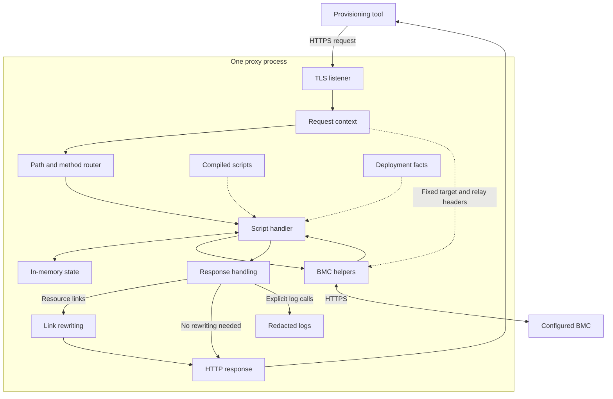
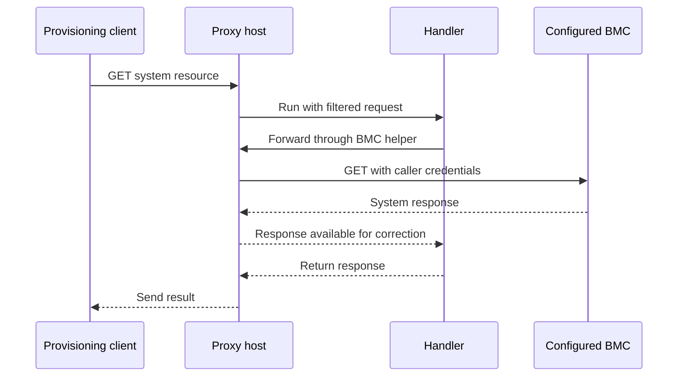
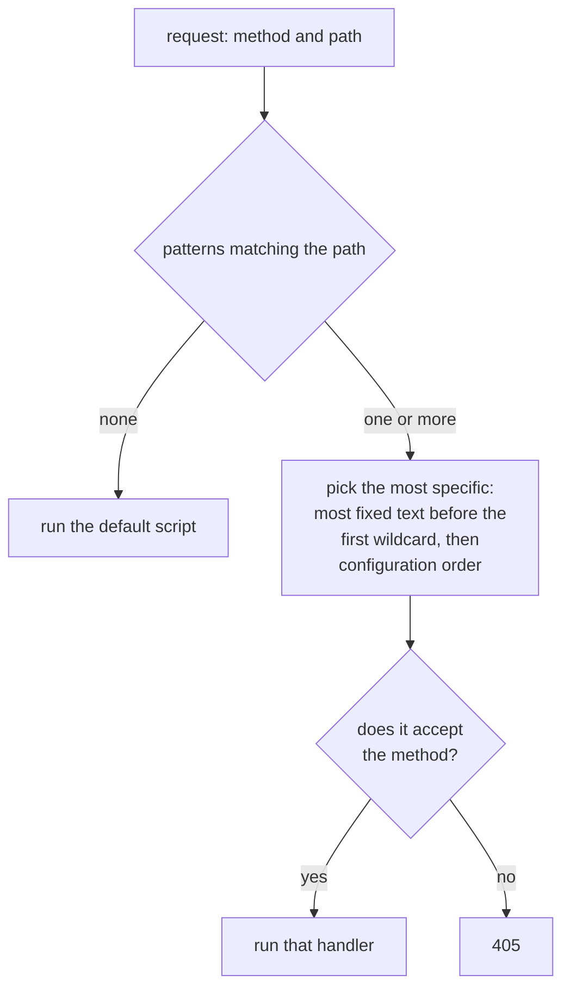
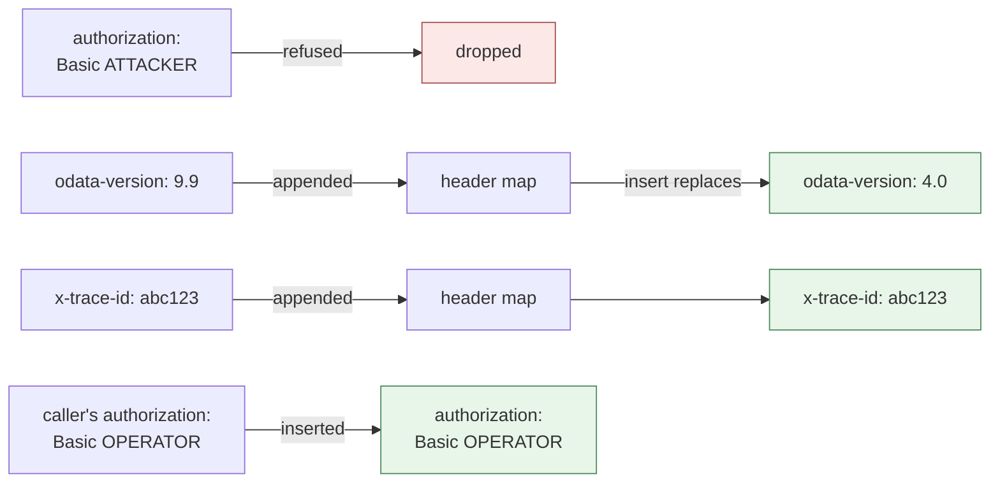
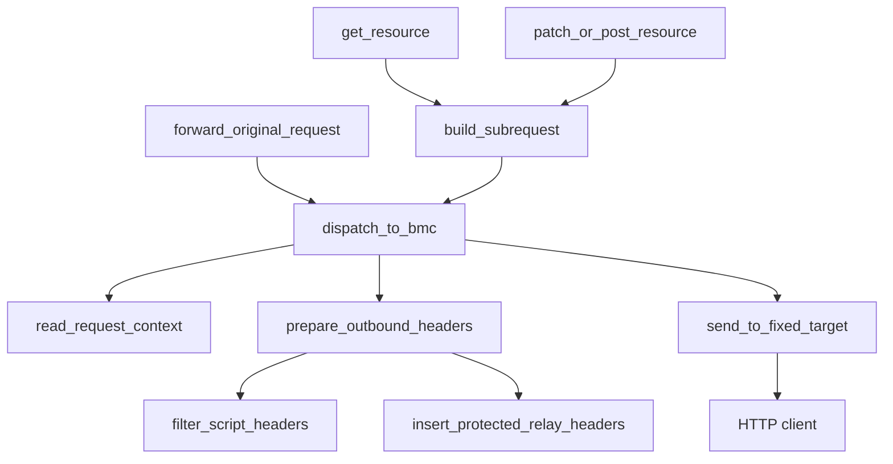
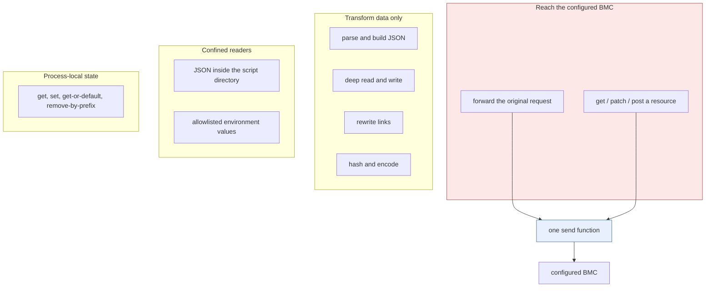

A design for a Redfish proxy that handles selected API differences through scripts, covering request handling, data correction, and the helper surface a host must provide.

> **Code examples:** We will use pseudocode throughout this post. The examples and diagrams show intended logic and structure, not runnable code or measurements from a running implementation. The implementation requires an HTTP server, an embedded script runtime, and host-controlled network helpers.

In [Modern BareMetal Provisioning Without PXE](https://t0.mirantis.com/modern-baremetal-provisioning/), we described provisioning through Redfish, UEFI, and boot images built when needed. The [follow-up on provisioning without DHCP](https://t0.mirantis.com/modern-baremetal-provisioning-without-dhcp/) covered image delivery when the expected BMC virtual media path is unavailable.

Both workflows depend on the management API returning the data and supporting the actions the client expects.

## Start with One Inventory Request

Consider a provisioning client that requires a serial number to register a machine. A system resource returns HTTP 200 with these fields:

```json
{
  "SerialNumber": "  ",
  "UUID": "12345678-1234-1234-1234-123456789abc"
}
```

The request succeeded, but the serial number is blank. The result depends on the client: it may reject the record or try another identifier. For this example, assume the client cannot proceed without that field.

The UUID gives us a substitute, provided the client accepts a derived inventory value. When changing the client or BMC firmware is impractical, correct the value in a proxy between them.

## Put a Proxy Between the Client and the BMC

One process fronts one BMC, and every request is handled by a script. Scripts may change a request path or body, but the helper API must not let them select another host or replace the protected headers.



The host terminates TLS, holds the target and the caller's protected headers in a request context, and routes on path and method to a compiled handler. That handler can call the BMC helpers, read deployment facts, use process-local state, and build a response. Responses carrying resource links pass through link rewriting on the way out.

A handler is the script function that processes a request and returns a response.

Handlers are compiled at runtime rather than built into the host, so they can be swapped without a restart. Compile a replacement set, activate it only if every script compiles, and keep each in-flight request on the version it started with. Target, TLS, and route changes still need a restart.



The client connects to the proxy's Redfish endpoint. The host forwards supported authentication headers to the configured BMC. It does not create a new BMC identity for the caller.

A first handler forwards the request and logs metadata:

```text
ASYNC FUNCTION handle(request):
    log_request(level = INFO, include_body = FALSE)
    response = AWAIT forward_original_request()
    log_response(response, level = INFO, include_body = FALSE)
    RETURN response
```

`forward_original_request` is a host helper. It sends the original method, path, query, and body to the configured BMC.

Route every record through one host renderer, so hiding secrets and bounding length are host decisions rather than per-handler ones. Keep request-body logging off by default: a session login carries a password in the body, and hiding authentication headers does nothing for it. Shortening a body does not remove secrets from it either.

## Keep the Next Request on the Proxy

A Redfish response contains links to other resources. A full URL pointing at the BMC makes the client bypass the proxy on its next request.

Rewrite matching BMC URLs to the proxy's external URL:

```text
Before:
    https://192.0.2.10:8443/redfish/v1/Systems/1

After:
    https://redfish-proxy.example.com/redfish/v1/Systems/1
```

Replace the protocol, host, and port together. Replacing only the IP address leaves the wrong port. Relative paths already use the proxy when the client resolves them against the proxy URL.

The handler now adds one step:

```text
ASYNC FUNCTION handle(request):
    log_request(level = INFO, include_body = FALSE)
    response = AWAIT forward_original_request()
    response = rewrite_response(response)
    log_response(response, level = INFO, include_body = FALSE)
    RETURN response
```

`rewrite_response` applies the header and body rules. It checks relevant URL headers, such as `Location`, and parses bodies that declare JSON. If JSON parsing fails, return an error rather than pass through the original body. Non-JSON bodies stream through without rewriting, and an empty response has no body to rewrite, though its headers may still carry links. Response and document helpers should share one replacement function rather than each implementing the swap.

## Complete the First Correction

The system handler forwards the request, checks the result, and replaces the serial number only when it is missing or invalid. Preserve BMC failures.

`derive_serial` is handler logic shown below; the rest are host helpers.

```text
ASYNC FUNCTION handle_system(request):
    log_request(level = INFO, include_body = FALSE)
    upstream = AWAIT forward_original_request()

    IF upstream FAILED OR NOT upstream.declares_json():
        response = rewrite_response(upstream)
        log_response(response, level = INFO, include_body = FALSE)
        RETURN response

    system = parse_json_or_fail(upstream.body)
    serial = lookup(system, "SerialNumber")

    IF serial IS NOT TEXT OR trim(serial) IS EMPTY:
        system.SerialNumber = AWAIT derive_serial(system)

    response = json_response(upstream.status, system)
    response = copy_allowed_response_metadata(upstream, response)
    response = rewrite_response(response)
    log_response(response, level = INFO, include_body = FALSE)
    RETURN response
```

Use this handler for the intended system GET route. `copy_allowed_response_metadata` preserves relevant response metadata and updates or removes values affected by the body change, such as content length or a validator for the original representation.

A consistent replacement can use the UUID first, then an agreed fallback:

```text
ASYNC FUNCTION derive_serial(system):
    uuid = lookup(system, "UUID")
    IF uuid IS TEXT AND trim(uuid) IS NOT EMPTY:
        RETURN uppercase(remove_hyphens(uuid))

    address = configured_bmc_address()
    manager = AWAIT discover_manager_id()
    seed = encode_tuple(address, manager)
    RETURN uppercase(sha256(seed))
```

| Available data | Value returned | Limit |
| --- | --- | --- |
| Valid serial number | Original serial | Leave valid data unchanged. |
| Blank serial, usable UUID | UUID with hyphens removed | This is an inventory substitute, not a manufacturer serial number. |
| No usable serial or UUID | Hash of BMC address and manager ID | The result changes if those inputs change. |

If the client needs an identity that survives management address changes, supply a fixed inventory ID through deployment data instead. Do not generate a new random value on each request.

Where the client expects system and chassis fields to identify the same machine, derived values need to agree. Do not overwrite valid, distinct component serial numbers to force that agreement.

## Select Handlers and Define the Host API

### Selecting the handler

Configure routes with wildcard path patterns and optional HTTP method limits. A route entry can send system GET requests to the correction handler:

```text
ROUTE:
    path_pattern = "/redfish/v1/Systems/*"
    handler = "vendor/systems"
    methods = [GET]
```

Define `*` to match within one path segment and `**` to cross separators.



A longer pattern does not always take priority. Specificity is the fixed text before the first wildcard, not the pattern length. Matching usually settles it before precedence is consulted, because a single-segment `*` cannot cross a separator, so shallower patterns never match a deeper path. Compile the patterns and reject duplicate route paths during startup.

### Protect the BMC address and credentials

Scripts need enough control to repair requests and responses. They do not need to redirect a caller's credentials to another host.

Keep the target and protected headers in host data tied to the current request, read directly by the network helpers. No helper may accept a destination or a protected header as an argument.

A script can read the configured BMC address but cannot replace it. Disable redirect following in the HTTP client, so an upstream `Location` cannot send it to an arbitrary host. Verify the upstream certificate against the appropriate trust roots or a private CA bundle. A fixed destination does not replace certificate verification.

For requests built by scripts, remove the headers scripts are not allowed to set, then add the caller's protected headers, replacing any existing values. Set `Host` from the configured BMC and calculate body-length headers from the actual body.



The design needs both defences. The authentication header never reaches the map, because the filter refuses it. The version header is allowed in and then loses, because inserting replaces every existing value for a name where appending only adds to it. A header that is neither, like a trace id, survives untouched.

Define the header policy centrally. At a minimum, prevent scripts from reading these headers and hide their values in logs:

- `Authorization`
- `Proxy-Authorization`
- `X-Auth-Token`
- `Cookie`
- `Set-Cookie`

Visibility and forwarding are separate policies. Relay the end-to-end authentication headers the BMC expects; remove hop-by-hop headers. Extend the protected set when supporting a vendor authentication header such as `X-Api-Key`.

Treat the script interpreter as an embedded runtime, not a security sandbox. Build its context without general filesystem, HTTP, or process modules, and disable direct standard-output functions that could bypass the log renderer. If environment access is needed, require an explicit allowlist and deny access by default.

None of this hides secrets carried in request bodies or unrecognized headers. Scripts and any added host functions still need review before deployment.

### Send BMC requests through one function

All network helpers — GET, PATCH, and POST — use one request-sending function and one HTTP client.



One function reads the target from host data, validates that the path is
target-relative, filters the script's headers, adds the protected ones, rebuilds
`Host` and body framing, and sends with redirects disabled. Every header step
finishes before the request goes out.

## Add Other Read Corrections

These examples leave out routine logging already shown in the complete handler.

### Use an alternate path

For `/Bios` versus `/BIOS`, retry the alternate spelling on 404, preserving the method and body.

For a read request, use this fallback:

```text
response = AWAIT get_resource(request.path)
IF response.status == 404:
    alternate = replace_path_segment(request.path, "Bios", "BIOS")
    response = AWAIT get_resource(alternate)
RETURN rewrite_response(response)
```

An authentication failure, timeout, or rejected setting is not evidence that the resource has another spelling. Retrying those responses as naming differences would hide the actual failure.

For writes, only retry when the response establishes that the original operation was not applied.

### Supply required deployment data

A missing BMC MAC address needs different treatment. If the client uses it as a registration identity, inventing a replacement would misrepresent the machine.

Supply the actual value through `vendor/facts.json`. A missing required value returns 500 naming the deployment fact.

```text
facts = read_json_inside_script_directory("vendor/facts.json")
IF facts.BmcMacAddress IS MISSING OR EMPTY:
    RETURN error_response(500, "Missing required BmcMacAddress")

resource.MACAddress = facts.BmcMacAddress
```

Optional fields can follow a different rule. If the data file has no `UefiDevicePath` for a NIC, the handler can leave that field unset.

Provide one JSON file reader that checks the full resolved path and allows only files inside the scripts directory.

### Build a collection response

Some clients request expanded collections so they can inspect member properties without fetching each resource themselves. If the BMC cannot expand a collection, the script assembles the expansion itself:

```text
collection = AWAIT get_json(collection_path)
expanded = []
FOR EACH member IN collection.Members:
    path = validate_link_for_configured_target(member["@odata.id"])
    expanded.append(AWAIT get_json(path))
collection.Members = expanded
RETURN rewrite_document(collection)
```

Every fetch must use the configured BMC, even when the response contains full URLs. If you add parallel fetches, limit their number to avoid overloading the BMC.

Scripts can also build resources from deployment data. For example, a PCIe inventory collection can combine BMC data with a file that maps hardware addresses to device paths.

A script may also need to return less detail. Expanded vendor data can cause a client to select a feature that the BMC does not support. Returning only member links may prevent that mistake. Document which client behavior requires this change.

## Handle Writes and Actions

Writes and actions must preserve the requested effect: return an error when the BMC cannot perform the operation, and keep the distinction between accepted and completed work.

### Map a supported action

A vendor-specific restart endpoint could map onto `ComputerSystem.Reset` with `ResetType` set to `ForceRestart`, if that matches the effect the caller needs.

```text
IF requested_action == VENDOR_RESTART:
    REQUIRE target_supports("ForceRestart")
    REQUIRE mapped_action_matches_required_effect()
    response = AWAIT post_resource(
        system_path + "/Actions/ComputerSystem.Reset",
        { ResetType: "ForceRestart" }
    )
    IF response FAILED:
        RETURN propagate_failure(response)
    RETURN rewrite_response(response)
```

Preserve the upstream status and task information. A Redfish `202 Accepted` response means processing is not complete and includes a `Location` header for a task monitor. Rewrite that link as needed and let the client track completion; do not replace the response with 204. See the [DMTF Redfish specification, asynchronous operations](https://www.dmtf.org/sites/default/files/standards/documents/DSP0266_1.22.1.html#asynchronous-operations).

An AC power cycle is a different operation. Restarting the host may not remove and restore power. If the upstream API cannot perform the required operation, return an explicit unsupported-operation response.

### Unsupported values

A handler can implement a controlled fallback when the target rejects a value. The decision must include the caller's requirements: changing `UefiHttp` to `Pxe` would violate a workflow that explicitly excludes PXE.

Where a fallback is acceptable, expose it in the response. An `x-boot-target-fallback` header identifies the substituted target. Check that the fallback write succeeded before reporting it as applied.

The header tells the caller that a different value was used. It does not mean that the two operations have the same effect.

| BMC result | Proxy behavior |
| --- | --- |
| Rejected operation | Return the failure; do not report the change as applied. |
| Accepted asynchronous operation | Preserve 202 and task information; rewrite links as needed. |
| Completed operation | Preserve the appropriate completion response. |

### Refusing an operation clearly

Some requests cannot be translated. If account credentials are managed outside the provisioning workflow, a password-change request returns 501 with a Redfish error body explaining where to make the change.

Reject an unsupported password update without automatically rejecting unrelated account fields. Distinguish unsupported operations from invalid input and upstream failures.

## Optional Use Case: Emulate Missing Resources

The same architecture adapts a generic emulator for vendor-specific provisioning tests. For resources the emulator cannot retain, expose a small state-store API.

In an emulator, some test actions may return success without doing any work. A manager reset could return 204 when there is no separate BMC process to restart and the test does not depend on that effect. Comment the assumption in the handler.

Validate the write, store it under a key that includes the system or manager ID, and include the stored value in later reads.

Emulation can be partial. A handler might forward supported boot override fields upstream while keeping an emulated `BootOrder` locally.

```text
key = encode_tuple("emulated_boot_order", system_id)

IF request.method == PATCH AND request.body CONTAINS BootOrder:
    order = validate_boot_order(request.body.BootOrder)
    state_store.set(key, order)
    RETURN status_response(204)

IF request.method == GET:
    system = AWAIT get_json(system_path)
    system.Boot.BootOrder = state_store.get_or(key, [])
    RETURN json_response(200, rewrite_document(system))
```

Define when stored values are kept or lost:

| Event | Stored values |
| --- | --- |
| Another request | Retained |
| Successful script reload | Retained |
| Failed script reload | Retained |
| Process restart | Lost |

An unlocked test machine might start with Secure Boot and lockdown disabled and its host interface enabled. Reading a value from proxy memory does not prove that the hardware setting changed.

For physical servers, a successful write must reflect a device operation or return a clear refusal. Use local storage only for settings that the proxy itself manages.

Set limits for the number of keys, key length, and stored value size. Store firmware images and large inventory records elsewhere.

## Validate and Operate

Startup loads TLS material, compiles route patterns and scripts, and checks that every referenced script exists, all before the listener accepts requests.

```text
FUNCTION start(config_path, check_only):
    config = load_and_validate_config(config_path)
    tls = load_tls_material(config)
    routes = compile_and_validate_routes(config)
    scripts = compile_all_scripts(config.script_directory)
    verify_route_handlers_exist(routes, scripts)
    client = build_fixed_target_client(config.target)

    IF check_only:
        RETURN SUCCESS

    serve(bind(config.listen), tls, routes, scripts, client)
```

Expose a `--check` mode that performs the same validation and exits without binding a socket.

A handler failure must not trigger direct forwarding: the original response may be what the handler exists to correct. Use the Redfish error format so clients can read the error. Apply these failure rules:

| Failure | Result in this design |
| --- | --- |
| Invalid startup configuration or scripts | Stop before accepting connections. |
| Runtime handler failure | Return 502; do not fall back to direct forwarding. |
| BMC timeout | Return 504. |
| Failed script reload | Keep the previous script set serving. |

## Define the Helper Surface

The host offers a fixed set of helpers, grouped by what each one can reach.



Only the first group performs network I/O, and it funnels through a single send
function that supplies the destination and the protected headers. A data helper that
called the HTTP client, or a file helper that escaped its directory, would be a
review finding rather than a design choice.

Each use-case in this post needs a different slice of it:

| Use-case | Helpers it needs |
| --- | --- |
| Forward a request unchanged | forward the original request; rewrite links in the response |
| Correct a field in a response | forward; parse JSON; deep read and write; build a JSON response |
| Return a consistent derived identity | read the configured target address; discover the manager id; hash |
| Serve a resource under an alternate path | issue a GET; retarget a request seeded from the caller's |
| Supply data the target cannot report | read JSON confined to the script directory; build an error response |
| Assemble an expanded collection | issue a GET per member; validate each link against the configured target |
| Map a vendor action onto a supported one | issue a POST; propagate the upstream failure |
| Emulate state the target cannot hold | get, set, get-or-default, remove-by-prefix |
| Record what happened | log the request and the response through the host renderer |

Handle new firmware differences by writing another handler against the same surface,
not by changing the host.

For each handler, record the original response and the client requirement it serves, and validate it against the relevant client, BMC model, and firmware version. API changes alone cannot add a hardware function that the target does not support.
