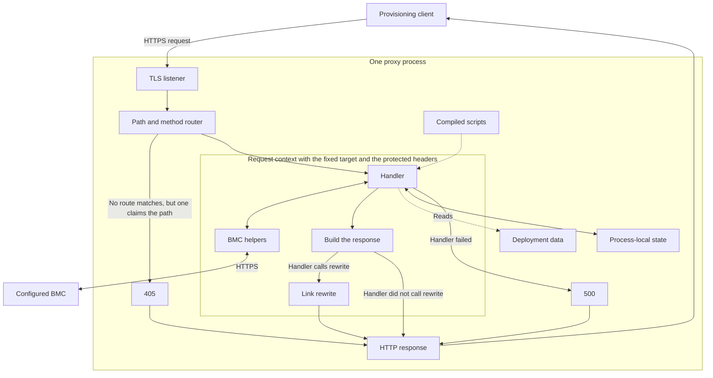
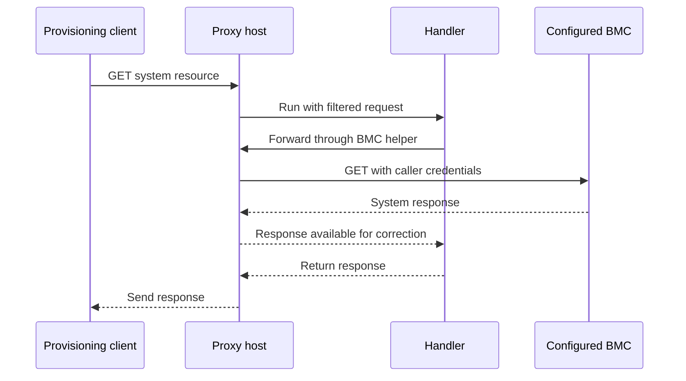
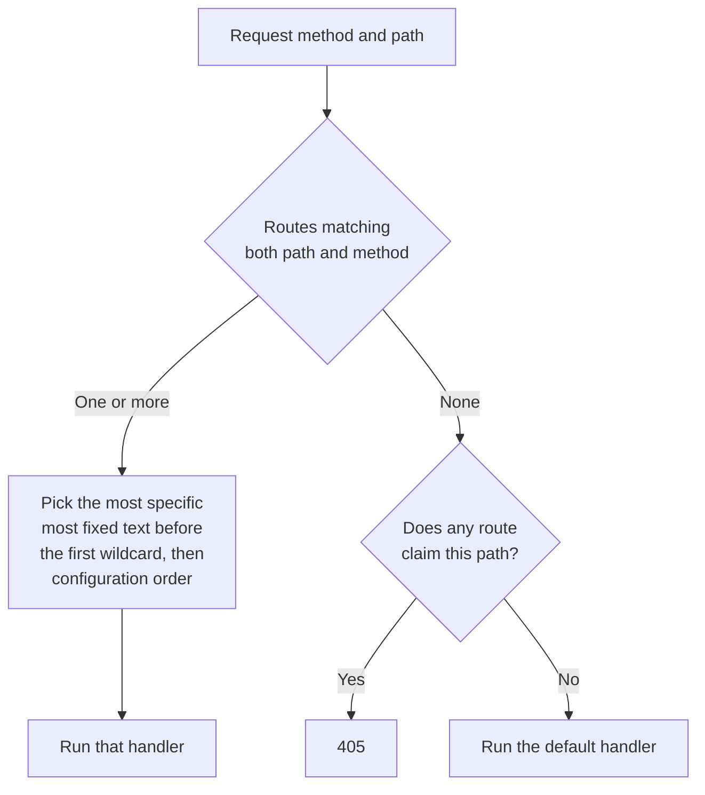
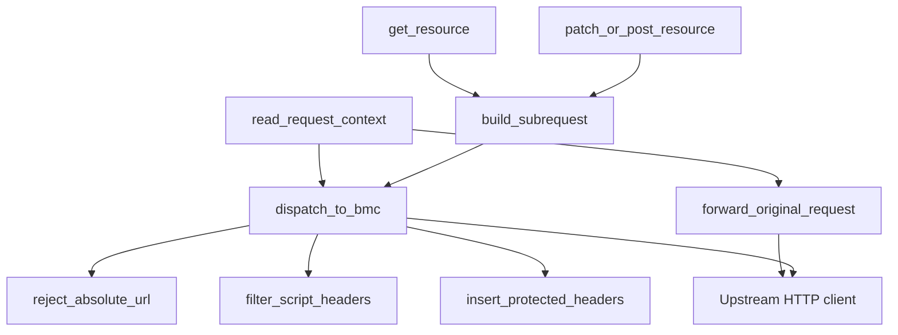

A design for a Redfish proxy whose scripts correct the differences between vendor implementations of the API.

> **Scope:** This is a design sketch, not a shipped or supported product, and nothing here is a deployment recommendation. The examples and diagrams are pseudocode. They show the intended logic, not code you can run. An implementation needs an HTTP server, an embedded script runtime, and BMC helpers that the host controls.

In [Modern BareMetal Provisioning Without PXE](https://t0.mirantis.com/modern-baremetal-provisioning/), we described provisioning with Redfish, UEFI, and boot images built on demand. The [follow-up on provisioning without DHCP](https://t0.mirantis.com/modern-baremetal-provisioning-without-dhcp/) covered image delivery when the expected BMC virtual media path is unavailable.

Both workflows depend on the management API returning the data and supporting the actions the client expects.

## A Successful Response the Client Cannot Use

Assume a provisioning client needs a serial number before it can register a machine. The system resource returns HTTP 200 with these fields:

```json
{
  "SerialNumber": "  ",
  "UUID": "12345678-1234-1234-1234-123456789abc"
}
```

The request succeeded, but the serial number is blank. Assume too that the client cannot continue without that field, and that you cannot change what the BMC reports.

The response does carry a UUID, so the correction can happen in a proxy between the client and the BMC.

## Put a Proxy Between the Client and the BMC

The proxy has to satisfy these requirements:

- One proxy process serves exactly one BMC.
- A script handles every request.
- A script can change a request's path or body.
- No helper lets a script choose a different host.
- No helper lets a script replace the protected headers.



The host picks a compiled handler from the path and method, then builds a request context holding the fixed target and the caller's protected headers. The handler and the BMC helpers both run inside that context.

A handler is the script function that takes a request and returns a response. Its name is fixed. Every script exposes one function called `handle`, and a route names the script file rather than the function. If a handler fails, the proxy returns 500 rather than forwarding the request itself, since the untouched response may be exactly what the handler existed to correct. A script fault is a server-side error, not the invalid upstream reply that 502 describes. Render that failure as a Redfish `error` object so the client can parse it like any other error.



The client connects to the proxy's Redfish endpoint. The host strips the protected headers out of the request it hands to the handler, so a script never holds the credential it is relaying, and forwards those headers to the configured BMC itself. The proxy holds no BMC credential of its own.

A pass-through handler forwards the request and rewrites the links in what comes back:

```text
ASYNC FUNCTION handle(request):
    RETURN rewrite_response(AWAIT forward_original_request())
```

`forward_original_request` sends the original method, path, query, headers, and body to the configured BMC, less the hop-by-hop headers, `Host`, and `Accept-Encoding`.

Responses can contain links pointing at the BMC's own address. They turn up in two places:

- in headers such as `Location`, which a BMC sets when it creates a resource or accepts a long-running action
- inside the JSON body, where an `@odata.id` is an absolute URL rather than a path

Most services emit `@odata.id` as a path, which the spec permits and which already resolves against the proxy URL. A handler calls `rewrite_response` to change both. Without it, the client's next request goes straight to the BMC and skips the proxy. The rewrite covers protocol, host, and port together, because replacing only the IP address leaves the wrong port behind. Match a full scheme and authority, never a bare address string.

Put the type check in the helper rather than in each handler. `rewrite_response` fixes the headers on any response and touches the body only when it declares JSON, parsing and re-encoding it instead of substituting over bytes. Anything else streams past untouched, which is why the pass-through handler above needs no guard of its own.

### Route a Request to a Handler

Each route has a wildcard path pattern and, optionally, the list of HTTP methods it accepts. This entry sends system requests to the correction handler:

```text
ROUTE:
    path_pattern = "/redfish/v1/Systems/*"
    handler = "vendor/systems"
```

Define `*` to match within a single path segment, and `**` to cross separators, so `/redfish/v1/Systems/**` would also claim the action endpoints beneath each system. Write the service root as `/redfish/v1/`, and account for both the slashed and unslashed spellings, because some implementations link with a trailing slash.

There is no `methods` list here on purpose. Route paths have to be unique, so one pattern gets one handler and that handler sees every method routed to it. A method list narrows which requests reach the handler, and anything left out gets 405 unless a broader pattern claims the path. A boot override is set with `PATCH /redfish/v1/Systems/{id}`, so constraining this route to GET would answer 405 for an operation the BMC supports.



A route that does not accept the method is skipped during selection, so a broader route that does accept it can win instead. Paths that no route claims fall to a configured default handler, which normally forwards and rewrites.

The proxy generates that 405 itself, so there is no upstream header to relay and it has to build one. Answer with an `Allow` listing the methods the path's routes accept, which is the same set the router just consulted. HTTP requires it on every 405, and Redfish requires it again on a 200 from a GET.

The most specific pattern is the one with the most fixed text before its first wildcard, so a longer pattern does not always win. Matching usually settles it before precedence comes up, because a single-segment `*` cannot cross a separator and a shallow pattern therefore never matches a deeper path. Compile the patterns at startup and reject duplicate route paths.

## Correct the Serial Number

The handler forwards the request and, when the response is JSON, hands the parsed body to `derive_serial`, which decides whether the serial number needs replacing. A failure from the BMC is returned as it came, with only the link rewrite applied.

In the two blocks below, `handle` and `derive_serial` are handler logic. Every other name is a host helper.

```text
ASYNC FUNCTION handle(request):
    upstream = AWAIT forward_original_request()

    IF request.method IS NOT GET OR upstream FAILED OR NOT upstream.declares_json():
        RETURN rewrite_response(upstream)

    system = parse_json_or_fail(upstream.body)

    IF NOT is_computer_system(system):
        RETURN rewrite_response(upstream)

    system.SerialNumber = AWAIT derive_serial(system)

    response = json_response(upstream.status, system)
    RETURN rewrite_response(response)
```

Attach this handler to the system route. The guards matter because that route carries every method, and a `SerialNumber` written into a PATCH response would be a correction nobody asked for.

The host assembles a rebuilt response rather than letting it inherit one. It carries the status the handler passed in, the content type the constructor set, and a fixed allowlist forwarded from upstream. That allowlist needs `OData-Version`, which Redfish requires on every response, `X-Auth-Token`, which is how a session POST returns its token, and `Location`, which the link rewrite above depends on. It also needs `Allow`, `Cache-Control`, and the `Link` header carrying `rel=describedby`, all three of which Redfish requires on a GET. The host recomputes content length from the body it is sending. Authentication and hop-by-hop headers a handler tries to set are dropped, which is why `X-Auth-Token` is carried by the host rather than supplied by the script.

The derivation has to give the same answer every time. Keep whatever serial the BMC reported, fall back to the chassis, then the UUID, and only then to a digest:

```text
ASYNC FUNCTION derive_serial(system):
    serial = lookup(system, "SerialNumber")
    IF is_real_serial(serial):
        RETURN trim(serial)

    chassis = AWAIT get_linked_chassis(system)
    IF chassis LINKS BACK TO THIS SYSTEM AND NOTHING ELSE:
        IF is_real_serial(chassis.SerialNumber):
            RETURN trim(chassis.SerialNumber)

    uuid = lookup(system, "UUID")
    IF is_real_uuid(uuid):
        RETURN uppercase(uuid)

    address = configured_bmc_address()
    manager = AWAIT discover_manager_id()
    id = AWAIT discover_system_id()
    RETURN uppercase(sha256(join(address, manager, id)))
```

Both guards do more than test for an empty string. `is_real_serial` rejects the SMBIOS placeholders, because a whole fleet reporting `To be filled by O.E.M.` passes a non-empty check and then collides under one identity. `is_real_uuid` rejects the nil UUID and the same known constants. Keep the UUID's hyphens, since the canonical form is what every other tool reports.

Neither guard can do more than that. One process sees one BMC, so it cannot know a UUID was already used elsewhere, and a check that consulted a changing registry would break the determinism this section just asked for. Whitebox and ODM boards do ship one UUID across a production batch, and catching that is the inventory system's job.

Chassis discovery is the one rung that can fail. If it errors or finds nothing, fall through to the UUID. The mutual-link test is what keeps it honest, because a service that links a system straight to a shared enclosure would otherwise hand the same serial to every occupant. Fall through whenever that test does not hold, rather than guess.

| Available data | Value returned | Caveat |
| --- | --- | --- |
| Real serial number | The original serial | Leave valid data alone. |
| Chassis serial | The chassis serial | A real manufacturer serial, used only where the system and the chassis link to each other and to nothing else. A chassis serial names the enclosure, not the board. |
| Usable UUID | The UUID, canonical form | Byte order varies between implementations, so this may not match `dmidecode` on the same machine. |
| None of the above | A digest of BMC address, manager ID, and system ID | Manager IDs are near-constant per vendor, so the system ID is what separates two systems behind one BMC. |

A derived serial is a proxy-generated inventory substitute, not a value the manufacturer attested to, and nothing downstream should treat it as one. Record which machines carry one. If the client needs an identity that survives a management address change, supply a fixed inventory ID through deployment data instead. Do not generate a random value per request, and do not overwrite a valid chassis or component serial.

This corrects only the resource the route matches, which scopes the design to `/redfish/v1/Systems/{id}`. The schema declares two further URIs for a system, both under the composition service, and those are out of scope here. The same field also reaches a client through `GET /redfish/v1/Systems?$expand=.` and through `Chassis`, so either cover those paths too or state plainly that clients must not use them against the proxy.

## Protect the BMC Address and Credentials

Build the runtime with the helper modules and nothing else. No standard networking, filesystem, process, or import surface means a script has no way to reach the network except through a helper, which is what makes the next paragraph a structural property rather than a convention.

The requirement is that a script cannot direct the caller's credentials at a host other than the configured one. The host meets it by keeping the target and the protected headers in the request context, which the BMC helpers read directly. No helper takes a host or an auth value as an argument. Through those helpers a script can read the configured BMC address but has no way to replace it. That is a property of the helper surface, prefer hermetic helpers that depend only on their inputs, and confine the ones that must reach outside.

Helpers group by what they can reach:

- the configured BMC
- the response under construction
- pure data
- confined files and allowlisted environment values
- process-local state
- the log, through one host renderer

Only the first group reaches the network. It does so along two paths. One relays the inbound request. The other dispatches a request the script built, which is where the host filters script-supplied headers. Both read the fixed target from the request context.



`get_resource` and `patch_or_post_resource` are the wrappers a script uses to build its own request. Dispatch requires the script's path to begin with exactly one slash, which rejects an absolute URL and a network-path reference like `//other.host/redfish/v1` alike. It then strips the headers a script may not set and inserts the caller's protected headers, where inserting replaces a value that appending would only have added to.

The upstream HTTP client follows no redirects. Certificate verification is a deployment choice rather than something the design settles. BMC certificates are self-signed almost universally, so a site either pins its own CA bundle, which replaces the public roots, or turns verification off knowingly. A fixed destination does not settle it either way.

This protects the credentials the caller sends as headers. It does nothing for a session token that appears in a request or response body, which a script can read and a handler can copy anywhere it likes, the log included. The renderer redacts and clips the records the host builds, not a string a script hands it.

## Other Corrections Use the Same Design

The serial number is one example. The same shape should cover other differences. A handler could also:

- serve a resource whose path an implementation spells differently, such as one that links with a trailing slash
- supply a fact the BMC does not report, under `Oem` if the schema has no property for it
- assemble a collection the BMC declines to expand, which also means advertising `ExpandQuery` in the service root so conformant clients will ask
- map a vendor action onto a standard one, and patch the advertised allowable values so clients send the mapped name

Each of these is one more handler against the same helpers, and none of them obviously needs a new host capability. This post works through only the serial number.
